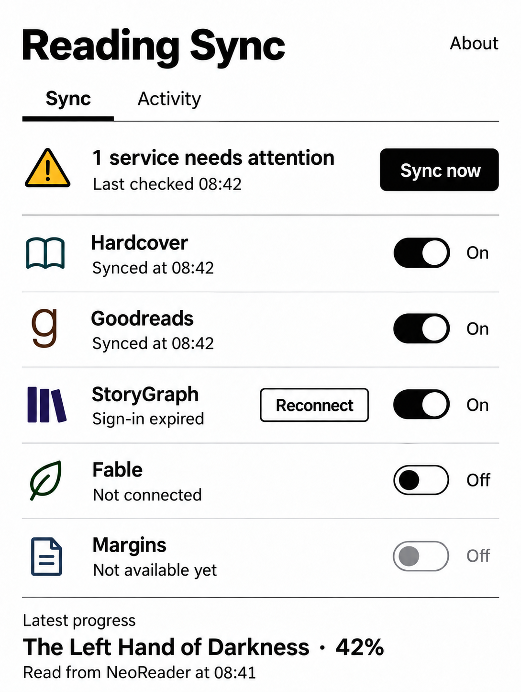

# Approved visual direction

Use the implemented layout below as the current contract. The image and historical sections preserve the visual reference, not obsolete controls or fictional account states. See [verification](verification.md) for screenshots and physical evidence.

The user selected the revised first concept: the first layout, the second concept's amber warning triangle, and coloured service icons. Other generated concepts were alternatives. The mockup is a visual direction, not proof of implemented services or signed-in accounts.

## Layout

The reference has a white background, large black title, About at top right, two tabs, an active-tab underline, separated service rows, and large controls. Its Reconnect button and lower latest-progress area are illustrative. Later user decisions remove both and put the book/progress/count/read time into the top section.

The implemented layout uses Sync/Activity. The header shows database title/progress, library count, and query time with a green circular check or amber warning triangle, plus black Sync Now with white text. Use Unknown title when the database has none, not the filename. Tap the book for bordered metadata. When the header warns, that popup first lists every current issue, NeoReader's and each enabled service's, one line each with the amber triangle and the full message (user decision, 2026-10-07). Services show the match with its edition note, or the error, separately from Pending/Synced at/specific failure; after a completed send the Synced at line shows Finished instead of a percentage. Coming services remain disabled. No source/destination selector, standalone Read Now, Connect button, lower diagnostic/progress sections, background toggle, or observation controls exist. About is bordered and includes folder replacement; Device Information is in Activity.

The metadata popup uses bold Title Case labels, with ISBN and ASIN uppercase. Show the full ISBN and existing identifier tags from the same database/ebook reader used for sync; omit absent service-tag rows. NeoReader Database and Progress State show OK only when their checks pass, otherwise the specific state or error. Last Access is NeoReader's saved timestamp; Read At is our query timestamp. Format both with the device's date/time settings, retaining raw unsupported timestamps and explicit missing/unreadable states. Identifier file reads must stay off the main thread. The popup has no explanation of fraction units; it was removed on purpose. Cancelling About's folder replacement keeps the existing grant when it is still readable; missing or revoked access still blocks the app.

The shared reader is the single tag allowlist. UI labels do not filter tags separately. It accepts ISBN, ASIN, Goodreads, Hardcover edition/book/slug, and explicit `storygraph:`, `fable:`, `margins:` identifiers. Fable matching uses `fable:` values that are Fable book UUIDs, and StoryGraph matching uses `storygraph:` values that are StoryGraph edition UUIDs. `margins:` accepts bounded opaque IDs for display only; that service has no lookup or send. Unknown tags and unrelated metadata are discarded before display. ASIN remains useful for the implemented Hardcover edition lookup.

Startup shows a bordered Ebook folder access explanation before opening the picker, with Exit / Choose folder. Explain the folder choice and metadata read access in plain words. Cancellation without an existing readable grant shows Exit / Allow again; cancelling About's replacement keeps valid access. Do not add a separate setup section. This folder gate is mandatory even though the provider itself needs no storage grant.

Sign-in happens in a bordered popup, not below the service row (user decision, 2026-10-07). Turning a service On without a session opens it. Outside taps do nothing; Cancel or Back cancels sign-in and turns the switch Off. Leaving the app, for example to approve Hardcover in a browser, keeps the popup. The popup is built once and updated in place, so typed text and focus survive screen updates. It closes when sign-in succeeds.

- **Hardcover:** "Requesting a sign-in code…", then the code in bold with the instructions in plain text, with Open Hardcover sign-in and Cancel buttons. A failed connection closes the popup and returns Off with a message on the row.
- **Fable:** a plain explanation, bordered Email and Password fields (56 dp, black on white), a status line, and Sign in / Cancel. Sign in is enabled only when both fields are filled. While signing in, the fields are disabled and the status reads "Signing in…". No spinner. A rejected email or password keeps the popup open with the reason and the email; the password field clears on every submit. Drafts are memory-only.

The StoryGraph popup holds StoryGraph's own sign-in page in a WebView that takes 60% of the screen height, below a two-sentence explanation ("Sign in on StoryGraph's own website. Boox Tracker never sees or remembers your password; it keeps the browser session on this device.") and above a status line; its only button is Cancel, because the page has its own Sign in. The page is loaded once and never reloaded by screen updates. StoryGraph's page and Cloudflare's check animate on their own; the app adds no animation of its own. A live session redirects to the home page, which closes the popup like a fresh sign-in; a session that cannot be captured keeps the popup open with the reason on the status line.

Tapping a provider row opens its bordered details popup (user decision, 2026-10-07), the same for every provider. The whole row is the tap target, also while a sync runs: icon, name, and both status lines; only the switch keeps its own tap. It shows the account (username and name, email where the provider allows it, connected since, account created, membership), Sync On/Off and queued updates, then the current book: title, how it matched, which edition receives progress, progress, shelf and streak day where the provider has them, NeoReader progress, and last sync. Buttons are Close and, when there is a session or queued data, Log out. Log out opens one confirmation that states every consequence in one sentence: "Boox Tracker will remove your Fable sign-in from this device, turn Fable off, and delete any updates that have not been sent yet." with the provider's name. Every implemented provider row is exactly three rows, whatever its state (user decision, 2026-10-07): the name, a status line, and a sync line, each one line and ellipsized when too long. The status line shows the most important of: sign-in state, Off, "❌ Reconnect required", "❌" with the held reason, "⚠ Streak day not marked" with the reason, the match ("✅ Book matched · same edition" when progress goes to the ebook's own edition, "✅ Book matched · different edition" when it goes to another edition, and "✅ Book matched" when the ebook's edition is unknown; user decision, 2026-10-07), or "Not matched yet". The sync line shows the sign-in hint, Off's reason ("Not connected", "Not syncing", or the sign-in error), "Pending" or "Not sent" with the last sync, or "Synced at …" / "Not synced yet", with the number of queued updates when there are any. A book matched on another edition is a success and never warns (user decision, 2026-10-07). When a tracker keeps higher progress than NeoReader, the sync line starts with ⚠ and the header shows the amber triangle; the popup shows the kept progress (user decision, 2026-10-07). Every ⚠ on a row is drawn as the header's amber triangle; the row text is unchanged (user decision, 2026-10-07). When there is an issue, the provider popup starts with it, just below the title: one line per issue, each with the amber triangle and the full message. Without an issue the section is absent (user decision, 2026-10-07). Edition explanations live only in the popup. Coming Soon rows keep their single "Coming soon" line.

Activity (user decision, 2026-10-07): the header is a bordered All / Issues segmented control (black fill on the selected half), a black Export button, and a Device information text button, above a black rule. Each row is at least 72 dp and fully tappable, with no button inside: a mark (✅ sent, signed in, or already current; ⚠ a tracker kept higher progress; ❌ an issue; • anything else), a bold one-line title in plain words ("Synced to Hardcover", "No change", "Hardcover update held"), a detail line that starts with the source (Background, Background delivery, App open, Manual, System) and gives the book, progress, or reason, the device-format time with a short date when not today, and a decorative chevron. Unchanged checks of one book share a row ("12 checks since 09:00"), and repeats of one issue share a row ("37 times since 09:00"), even when other checks come between them; any other event, such as a send, starts new rows. The Issues view groups issues among themselves. Finished background runs are not rows. Tapping a row opens a bordered popup titled with the row title and two static tabs: Summary, with bold labels and plain values, and JSON, with the newest event's stored record in a monospaced, selectable, scrollable view and a note when the row groups several events. The pane height is fixed, so switching tabs never resizes the popup. JSON is formatted the first time its tab opens. The popup does not change while the log grows and closes on recreation.

Normal offline Pending is neutral. An enabled service's authentication/delivery issue, a rejected Fable streak day, a tracker that keeps higher progress than NeoReader, or a current NeoReader read issue can warn; disabled services cannot. Keep last-success time/progress separately from the latest attempt and source book. Switching to a new book must not display the previous book's successful delivery. Turning a connected service On offline retains On and queues. No Wi-Fi prompt or background approval.

The approved mockup's service states are illustrative. Never add fabricated reading/account records to a distributable APK or claim a preview image is physical evidence. Signed emulator screenshots are under dist/screenshots; NeoReader is absent on that emulator.

## Colour and icons

| Element | Approved concept treatment |
| --- | --- |
| Warning | Amber triangle with black outline/exclamation mark |
| Hardcover | Dark teal book outline |
| Goodreads | Dark brown lowercase g |
| StoryGraph | Deep indigo/purple books or bars |
| Fable | Dark green leaf |
| Margins | Dark slate-blue document |

These are concept treatments, not a verified official brand-asset collection or complete design-token specification. Essential text and switches stay black/white. Labels, icon shapes, and switch position must communicate meaning without colour.

The mockup's service rows illustrated Hardcover and Goodreads enabled/synced, StoryGraph enabled with expired sign-in, Fable off/unconnected, and Margins unavailable with a disabled off toggle. Its book, percentage, and times were also illustrative. Do not present these as real accounts or ship them as real records.

## E-ink interaction

- Use strong contrast, readable black body text, flat surfaces, and clear separators. Essential text must not be pale.
- Keep touch targets at least 48 × 48 dp where feasible; the current primary buttons use 56 dp minimum height. Colour must remain supplementary on monochrome devices.
- Keep transitions static. Avoid spinners, animated switches, fading, marquees, and rapidly updating timers.
- Avoid gradients, shadows, decorative charts, unnecessary cover imagery, and large decorative filled regions. Retain black action buttons from the approved concept.
- Avoid unnecessary redraws and unexpected log movement while the user reads it. Further UI work must preserve useful diagnostic evidence and state.

Prior catalogue research cited 300 PPI monochrome and 150 PPI colour rendering for Go Color 7. This was a design lead, not a measured property or generation identification of the user's device. Layout must work on both monochrome and colour e-ink.

References for later validation: [BOOX Go 7 series](https://shop.boox.com/products/go7), [BOOX Go Color 7](https://shop.boox.com/products/gocolor7), and [Android accessibility](https://developer.android.com/codelabs/jetpack-compose-accessibility). The implemented toolkit is native Views/XML; the accessibility reference does not require migration to Compose.

## Historical 0.2.1 service layout: 2026-10-06

This section records the older screenshot. Do not restore its controls. The current layout above supersedes it.

The 0.2.1 UI uses the approved title/About header, static active-tab underline, status/action row, separated service rows, and latest saved progress summary. Tabs remain Diagnostics and Activity. Hardcover displays real connection and sync state, with a static opt-in switch. Turning it On enables an existing connection or starts sign-in; turning it Off cancels sign-in or stops sends. Disconnect remains in setup. Goodreads, StoryGraph, Fable, and Margins display Coming soon with disabled off switches. These rows do not imply API access or implemented connections.

Service artwork is downloaded, unmodified Apple App Store artwork, bundled locally. Its colours and shapes differ from the concept icons. In particular, the published StoryGraph artwork is black on white; it is not recoloured. See [artwork sources and rights](../docs/service-artwork.md).

Read now, provider outcome/count, expandable raw metadata and device information, EPUB folder setup, observation, and Background checks remain below the progress summary. Activity retains recycled rows and lazy details. No source-book selector, account fixtures, additional service integrations, or publication has been added. Service switches sit beside the service details; on narrow screens with large fonts, they move below the text to keep names readable. The header warns only for enabled services that need attention or a current NeoReader read issue. Disabled services do not cause a warning.

## UI verification and remaining work

Current metadata/startup/cancelled replacement have visual BOOX evidence. Native user-initiated exact match/delivery has user evidence. Other-service tag rows, the Fable row, and the Fable sign-in form have synthetic automated coverage only. The 0.3.0 signed API 32 emulator screens verify rendering without NeoReader/account fixtures. There is no complete physical accessibility or timed performance audit. Preserve recycled Activity rows, JSON formatted only when its tab opens, scroll state, and static transitions during further work.

Tests must wait for rendered book state before tapping it; a provider call count can advance before the UI has a usable snapshot. Folder validation state belongs to the Activity, while picker-in-progress state survives recreation. These lessons prevent missing dialogs and early-tap races without changing product behavior.
